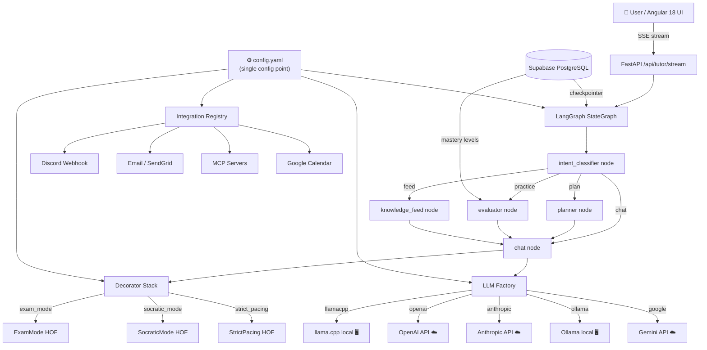

<div align="center">

# 🎓 Personal AI Tutor Agent

**Production-grade, self-healing personal tutor powered by LangGraph + FastAPI + Angular**

[](LICENSE)
[](https://python.org)
[](https://angular.io)
[](https://fastapi.tiangolo.com)
[](https://langchain-ai.github.io/langgraph/)
[](https://github.com/astral-sh/uv)

[Features](#features) · [Architecture](#architecture) · [Quick Start](#quick-start) · [Configuration](#configuration) · [Extending](#extending) · [API Reference](#api-reference) · [Contributing](#contributing)

</div>

---

## Overview

A **fully configurable, production-grade AI tutor** designed for senior engineers targeting FAANG and staff-level interviews. Built on LangGraph state machines for adaptive tutoring flows, with a single `config.yaml` that controls every behaviour — LLM provider, integrations, learning modes — with zero code changes required to switch between them.

### Key design principles

| Principle | Implementation |
|---|---|
| **Single config point** | `config.yaml` drives everything — providers, integrations, decorators, topics |
| **Pluggable LLM** | Factory + registry pattern; swap `llamacpp → openai → anthropic` via config |
| **Graph-native orchestration** | LangGraph `StateGraph` with Postgres checkpointing for resumable sessions |
| **Plugin integration bus** | `@IntegrationRegistry.register()` pattern — add any MCP, notifier, or API |
| **Runtime decorators** | HOF decorators alter LLM behaviour without code changes (`ExamMode`, `Socratic`, etc.) |
| **Streaming-first** | SSE streaming from LangGraph `astream_events()` → Angular `Observable<StreamEvent>` |

---

## Features

- 🧠 **Adaptive learning plans** — LLM-generated milestone-based roadmaps per topic
- 📊 **Progress tracking** — per-topic mastery scores (0–100) updated after every practice session
- 💬 **Real-time streaming** — token-by-token streaming responses via Server-Sent Events
- 🎯 **Practice & evaluation** — MCQ, open-ended, and system design practice with instant scoring
- 🗞️ **Knowledge feed** — daily Hacker News + GitHub Trending digest filtered by your topics
- 🔔 **Multi-channel notifications** — Discord, Slack, Email, Firebase Push (configurable)
- 🛡️ **Self-healing** — circuit breaker, exponential backoff, provider failover chain
- 🔌 **MCP integration** — connect any Model Context Protocol server (web-search, GitHub, filesystem)
- 📅 **Calendar integration** — Google Calendar study session scheduling
- 🔒 **Flexible auth** — none (dev), API key, or Clerk JWT — all switchable via config

---

## Architecture



### Directory structure

```
personalAITutor/
├── backend/                         # Python 3.12 + FastAPI + LangGraph (UV)
│   ├── config.yaml                  # ← SINGLE CONFIG POINT
│   ├── .env.example
│   ├── pyproject.toml
│   └── src/
│       ├── config/settings.py       # Config loader + *_env resolver
│       ├── llm/
│       │   ├── factory.py           # PROVIDER_REGISTRY — add providers here
│       │   ├── circuit_breaker.py
│       │   └── providers/           # One file per LLM provider
│       ├── graph/
│       │   ├── state.py             # TutorState TypedDict
│       │   ├── graph.py             # Compiled StateGraph
│       │   ├── nodes/               # intent_classifier, planner, chat, evaluator, feed
│       │   ├── edges.py             # Conditional routing
│       │   └── decorators/          # DecoratorRegistry + built-in decorators
│       ├── integrations/
│       │   ├── registry.py          # IntegrationRegistry — add plugins here
│       │   ├── mcp/client.py        # MCP server manager
│       │   └── notifier/            # Discord, Email adapters
│       ├── data/supabase.py
│       └── api/                     # FastAPI routers
│
└── frontend/                        # Angular 18 standalone components
    └── src/app/
        ├── core/services/
        │   ├── tutor.service.ts     # SSE streaming via fetch() + ReadableStream
        │   └── auth.service.ts      # Pluggable auth facade
        ├── features/
        │   ├── tutor/               # Real-time chat with streaming
        │   ├── dashboard/           # Progress charts
        │   └── settings/            # Runtime config & integration status
        └── shared/components/
            └── message-bubble/      # Markdown-rendering message component
```

---

## Quick Start

### Prerequisites

- Python 3.12+
- [UV](https://github.com/astral-sh/uv) — `curl -LsSf https://astral.sh/uv/install.sh | sh`
- Node.js 20+ and Angular CLI — `npm install -g @angular/cli`
- A GGUF model file (for local llama.cpp inference)

### 1. Backend setup

```bash
cd backend

# Copy and customise config
cp .env.example .env         # Add any API keys you want to use

# Install Python dependencies (without llama-cpp-python)
uv sync

# Install llama-cpp-python with GPU acceleration
# macOS Apple Silicon (Metal):
CMAKE_ARGS="-DLLAMA_METAL=on" uv add llama-cpp-python

# CUDA (Linux/Windows):
CMAKE_ARGS="-DLLAMA_CUDA=on" uv add llama-cpp-python

# CPU only:
uv add llama-cpp-python

# Download a model (example — Meta Llama 3.2 3B Q4)
mkdir -p models
curl -L -o models/llama-3.2-3b-instruct.Q4_K_M.gguf \
  "https://huggingface.co/bartowski/Meta-Llama-3.2-3B-Instruct-GGUF/resolve/main/Meta-Llama-3.2-3B-Instruct-Q4_K_M.gguf"

# Start the backend
uv run uvicorn src.main:app --reload --host 0.0.0.0 --port 8000
```

### 2. Frontend setup

```bash
cd frontend
npm install          # or: pnpm install
ng serve             # Angular dev server on :4200, proxies /api → :8000
```

Open **http://localhost:4200**

### 3. Switch to a cloud LLM instantly

Edit `config.yaml` only — no code changes needed:

```yaml
# config.yaml
llm:
  task_providers:
    chat:        "openai"    # ← change from "llamacpp"
    planning:    "openai"
    evaluation:  "anthropic"
```

Add your key to `.env`:
```bash
OPENAI_API_KEY=sk-...
```

Restart the backend — done.

---

## Configuration

All system behaviour is controlled by **`backend/config.yaml`**. This is the single source of truth.

### How the `*_env` pattern works

Values with keys ending in `_env` are resolved to environment variables at runtime:

```yaml
# config.yaml
llm:
  providers:
    openai:
      api_key_env: "OPENAI_API_KEY"    # → reads os.environ["OPENAI_API_KEY"]
      model: "gpt-4o"                  # → used as-is
```

Secrets live in `.env`. The YAML file is safe to commit.

### Config sections

| Section | What it controls |
|---|---|
| `app` | Name, environment, log level, CORS origins |
| `llm.task_providers` | Which provider handles each task type |
| `llm.providers.*` | Provider-specific parameters (model, temperature, context size) |
| `llm.fallback_chain` | Providers tried in order when primary fails |
| `llm.circuit_breaker` | Retry count, backoff, reraise policy |
| `graph.checkpointer` | `memory` (default) or `postgres` (persistent sessions) |
| `tutor.topics` | Curriculum definition — topics, subtopics |
| `tutor.active_decorators` | Behaviour modifiers active at startup |
| `decorators.available.*` | Per-decorator configuration |
| `integrations.enabled` | List of active integration plugins |
| `integrations.*` | Per-integration configuration |
| `notifier.schedules` | Cron-based reminder scheduling |
| `security.auth_mode` | `none` / `api_key` / `clerk` |

---

## Extending

### Add a new LLM provider

```python
# 1. backend/src/llm/providers/groq_provider.py
from langchain_groq import ChatGroq
from .base import AbstractLLMProvider

class GroqProvider(AbstractLLMProvider):
    def _validate(self): self._require("api_key")
    def build(self):
        return ChatGroq(api_key=self.config["api_key"],
                        model=self.config.get("model", "llama-3.1-8b-instant"))
```

```python
# 2. backend/src/llm/factory.py  — add ONE line
PROVIDER_REGISTRY = {
    ...
    "groq": GroqProvider,   # ← add this
}
```

```yaml
# 3. config.yaml — add config block
llm:
  providers:
    groq:
      type: "groq"
      api_key_env: "GROQ_API_KEY"
      model: "llama-3.1-8b-instant"
  task_providers:
    chat: "groq"   # ← switch to it
```

### Add a new integration

```python
# 1. backend/src/integrations/notifier/telegram.py
from src.integrations.base import BaseIntegration
from src.integrations.registry import IntegrationRegistry

@IntegrationRegistry.register("telegram")
class TelegramIntegration(BaseIntegration):
    async def initialize(self):
        self._require("bot_token", "chat_id")
        self._mark_ready()

    async def shutdown(self): pass

    async def send(self, message: str) -> None:
        import httpx
        async with httpx.AsyncClient() as client:
            await client.post(
                f"https://api.telegram.org/bot{self.config['bot_token']}/sendMessage",
                json={"chat_id": self.config["chat_id"], "text": message}
            )
```

```yaml
# 2. config.yaml
integrations:
  enabled: ["telegram"]
  telegram:
    type: "notifier"
    bot_token_env: "TELEGRAM_BOT_TOKEN"
    chat_id_env: "TELEGRAM_CHAT_ID"
```

### Add a new behaviour decorator

```python
# 1. backend/src/graph/decorators/timed_mode.py
from src.graph.decorators.registry import DecoratorRegistry

@DecoratorRegistry.register("timed_mode")
def timed_mode(llm, cfg):
    limit = cfg.get("limit_seconds", 900)
    extra = f"\n[TIMED MODE: {limit//60} min limit. Keep answers concise.]\n"
    # ... wrap llm with RunnableLambda
```

```yaml
# 2. config.yaml
decorators:
  available:
    timed_mode:
      limit_seconds: 900
tutor:
  active_decorators: ["timed_mode"]
```

### Add a new MCP server

```yaml
# config.yaml — no code needed
integrations:
  enabled: ["mcp_my_server"]
  mcp_my_server:
    type: "mcp"
    server_command: ["npx", "-y", "@my-org/mcp-server"]
    server_env:
      MY_API_KEY_ENV: "MY_API_KEY"
    tools: ["tool_name_1", "tool_name_2"]
```

```python
# backend/src/integrations/mcp/client.py — register ONE class
@IntegrationRegistry.register("mcp_my_server")
class MyMCPIntegration(MCPIntegration):
    """My custom MCP server."""
```

---

## API Reference

### `POST /api/tutor/stream` — Streaming chat (SSE)

```json
{
  "message": "Explain consistent hashing",
  "session_id": "uuid-optional",
  "topic": "system_design",
  "active_decorators": ["exam_mode"]
}
```

**Response** — Server-Sent Events stream:
```
data: {"type": "chunk", "content": "Consistent hashing is..."}
data: {"type": "chunk", "content": " a technique..."}
data: {"type": "node_complete", "node": "evaluator", "data": {...}}
data: {"type": "done"}
```

### `POST /api/tutor/chat` — Non-streaming chat

Returns full `TutorResponse` JSON when complete.

### `GET /api/health`

```json
{
  "status": "ok",
  "checks": {"database": "ok", "llm": "ok (llamacpp)"},
  "environment": "development",
  "version": "1.0.0"
}
```

### `GET /api/config/summary`

Returns current provider, decorator, and integration config (no secrets exposed).

### `GET /api/integrations`

Lists all registered and active integrations.

### `POST /api/integrations/{name}/reload`

Hot-reloads an integration without server restart.

---

## Deployment

### Backend — Railway (recommended)

```bash
# Install Railway CLI
npm install -g @railway/cli

railway login
railway new
railway up
```

Add environment variables in the Railway dashboard.

### Frontend — Vercel

```bash
npm install -g vercel
cd frontend
vercel deploy --prod
```

Set `NEXT_PUBLIC_API_URL` (or `environment.prod.ts → apiUrl`) to your Railway backend URL.

### Persistent sessions with Supabase

```yaml
# config.yaml
graph:
  checkpointer: "postgres"
  postgres_url_env: "SUPABASE_DATABASE_URL"
```

---

## Converting to PDF

The full implementation specification is in [`docs/PROJECT_OVERVIEW.md`](docs/PROJECT_OVERVIEW.md).

To convert to PDF:

```bash
# Using pandoc (recommended)
brew install pandoc
pandoc docs/PROJECT_OVERVIEW.md \
  --pdf-engine=xelatex \
  --variable geometry:margin=1in \
  --variable fontsize=11pt \
  -o docs/PersonalAITutor_Spec.pdf

# Or: open docs/PROJECT_OVERVIEW.md in VS Code,
# then use Markdown PDF extension (Cmd+Shift+P → "Markdown PDF: Export (pdf)")
```

---

## Contributing

Contributions are very welcome! See [CONTRIBUTING.md](CONTRIBUTING.md) for guidelines.

**Quick contribution paths:**
- 🆕 New LLM provider — add a `*_provider.py` + one registry line
- 🔌 New integration — add a class with `@IntegrationRegistry.register()`
- 🎛️ New decorator — add a function with `@DecoratorRegistry.register()`
- 🐛 Bug fixes, tests, documentation improvements

---

## License

Apache 2.0 — see [LICENSE](LICENSE). You are free to use, modify, and distribute this software in both open-source and commercial projects with attribution.

---

<div align="center">
  <sub>Built with ❤️ for engineers who want to study smarter, not harder.</sub>
</div>
# ai-tutor-agent
